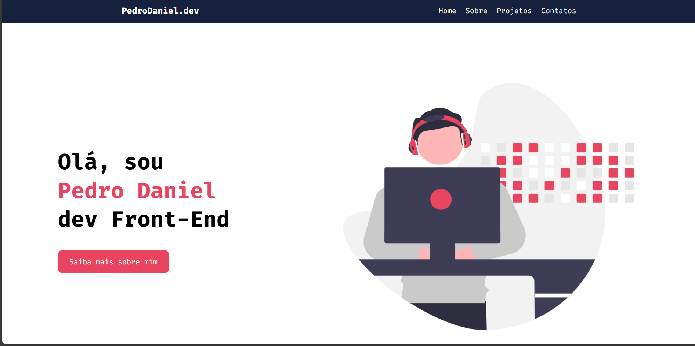

<h1 align='center'>
    Portfólio
</h1>
<br/ >



## 🧪 Tecnologias
Este projeto foi desenvolvido com as seguintes tecnologias:

- [React](https://react.dev/)
- [Javascript](https://developer.mozilla.org/en-US/docs/Web/JavaScript)

## 🚀 Como executar

Clone  o projeto e acesse sua pasta

```bash
$ git clone https://github.com/pdanmt/Portfolio
$ cd Portfolio
```
Para iniciá-lo utilize o npm:
```bash
# Instala as dependências
$ npm install

# Inicializa o projeto
$ npm run dev
```
A aplicação estará rondando no seu navegador pelo endereço [http://localhost:3000](http://localhost:5173).

## 🖥️ Projeto
O Portfólio é um projeto que fiz enquanto estava no início do meu aprendizado com React. Apesar disso, já me foi muito útil, visto que contém todos os meus projetos upados no github, de forma dinâmica.
Além disso, esse Portfólio também apresenta as principais tecnologias que aprendi em minha jornada.

Obs.: O design foi desenvolvido pelo professor [Edson Maia](https://www.youtube.com/c/professoredsonmaia)

---